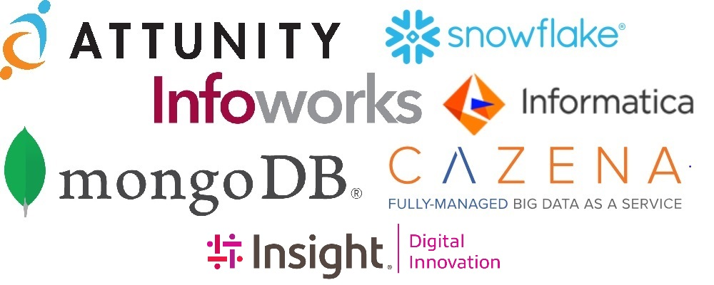

---
# Feel free to add content and custom Front Matter to this file.
# To modify the layout, see https://jekyllrb.com/docs/themes/#overriding-theme-defaults

title: Home
layout: default
---

# Welcome to Boston Azure Datafest!

We are pleased to announce that registration is open for the "Winter 2019 Boston Azure DataFest", a 1-day event to be held on Wednesday, January 9,  2019, 9:00AM to 5:00 PM at the Microsoft Technology Center at 5 Wayside Rd, Burlington, MA 01803. 

Please note - this is a paid conference, we are charging a nominal registration fee of $22.00 up to the 1/4/2019 registration deadline. Hurry though, we only have 200 seats available for this great one day event packed with over 30 sessions on the Mirosoft Azure Data Platform. This is a great event that you will *not* want to miss.

Help spread the word via twitter ( @azuredatafest #azuredatafest2019), LinkedIn, etc. Thank you for registering and we look forward to seeing you all at the event!
 
If you have a question about the event, please contact us via email at <adfboston.team@outlook.com>
 
**For event tickets please visit: <https://aka.ms/adfboston2019>**

This event would not have been possible without the help from our local user group communities and event sponsors who have helped organize the event, provide speakers, volunteer for event day activities, and much more. 

### [List of Confirmed Sessions]({{ site.baseurl }})

### [List of Confirmed Speakers]({{ site.baseurl }})

### [Full Agenda]({{ site.baseurl }})

### [Interactive Agenda]({{ site.baseurl }})

---

# Sponsors
A big thank you for out participating sponsors in this year's Boston Azure DataFest. 

 

**[Attunity](www.attunity.com)** 

**[Cazena](www.cazena.com)** 

**[Informatica](www.informatica.com)** 

**[Infoworks](www.infoworks.io)** 

**[Insight](https://www.insight.com/en_US/solve/digital-innovation.html)** 

**[MongoDB](https://www.mongodb.com/)** 

**[Snowflake](www.snowflake.com)**

---

# Supporting User Groups
Our community Azure and Data user groups have been instrumental in making this event happen. Please consider following up with your local user groups to continue the discussion on the topics that you have heard about today! 

| Group | Focus | Location | Time |
| ----- | ----- | -------- | -----|
| [The New England SQL Server User Group](https://www.meetup.com/nesqlug) | The Microsoft data platform| 5 Wayside Rd, Burlington, MA | 2nd Wednesday of the month at 6pm  |
| [The Greater Boston Data Science and Machine Learning Group](https://www.meetup.com/GreaterBoston-DataScienceGroup/) | Machine Learning and AI | 5 Wayside Road, Burlington, MA | See Posted Meetup |
| [The RI Microsoft Business Intelligence User Group](https://www.meetup.com/The-RI-Microsoft-BIUG/) | Microsoft business intelligence services | Bryant University, 1150 Douglas Pike · Smithfield, RI | See Posted Meetup |
| [Boston BI User Group](https://www.meetup.com/Boston_BI/) | Business Intelligence and Business Analytics | 5 Wayside Rd, Burlington, MA | 4th Wednesdays of the month |
| [SeacoastSQL](https://www.meetup.com/SeacoastSQL-User-Group/) | Microsoft Data Platform. We will do meetings on any area of the Data Platform from on-prem SQL Server to Azure, AWS RDS, BI, Data Science, etc... | We alternate locations with odd numbered months at Roundabout Diner, 580 Us Highway 1 Byp, Portsmouth New Hampshire 03801 and even-numbered months at Bank W Holdings, 5 Bedford Farms Drive, Suite 103, Bedford New Hampshire 03110 | 4th Monday of each month (Except December) |
| [North Boston Azure](https://www.meetup.com/North-Boston-Azure-Cloud-User-Group/) | Topics that are relevant to anyone using Azure | 5 Wayside Road, Burlington MA | 6:00 – 8:00pm last Tuesday of the month (except for December) |
| [Boston Azure](http://bostonazure.org) | The scope is topics relevant to those interested in the Microsoft Azurecloud platform. Examples: developing solutions with Azure services, efficient operations, running Azure securely, managing costs, managing data, comparing database options, managing disaster recovery, comparing service options within Azure and to other clouds, etc. Some talks are for beginners, some talks are more advanced. | Usually at Microsoft NERD in Cambridge (Memorial Drive), but sometimes in other locations | Usually 6:00 – 8:30 for around-once-a-month meetings, sometimes other formats |
| [Rhode Island SQL Server User Group](https://www.meetup.com/Rhode-Island-SQL-Server-Users-Group/) | Anything that has to do with the Microsoft data platform. | New England Technical Institute, 1408 Division Road, East Greenwich, RI, 02818 | First Wednesday of every month at 7 pm.  Check meetup for presentation details. |

